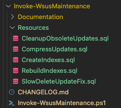
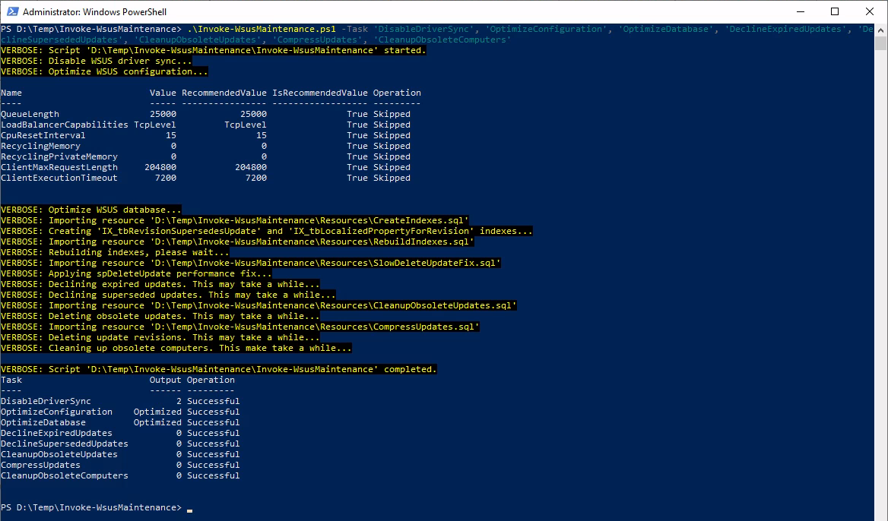

# Invoke-WsusMaintenancePowerShell Script

## Description

Runs WSUS maintenance tasks by performing various optimization and cleanup tasks.

## Use Case

Maintaining a clean, lean WSUS server and to improve overall performance.

## Design

The solution consists of a powershell script and various other resources which are stored in the  'Resources' folder.

```PowerShell
Invoke-WsusMaintenance.ps1
```

>Notes
>This is the main script and as with the whole solution needs to be ran from the WSUS server.

## Prerequisites

The 'Invoke-SQLcmd' commandlet is needed. In order to install it you need to run the command below. This module will be included in the final version.

```PowerShell
Install-Module -Name 'SqlServer'
```

## Parameters

### -Task

Specifies maintenance task to run.
Valid values are:

* `DisableDriverSync`
  Disables driver synchronization, major performance improvement.
* `OptimizeConfiguration`
Optimizes WSUS configuration, by setting recommended values.
* `OptimizeDatabase`
Optimizes WSUS database, by adding and rebuilding indexes, and applying a performance fix for delete updates.
* `DeclineExpiredUpdates`
Declines expired updates.
* `DeclineSupersededUpdates`
Declines superseded updates.
* `CleanupObsoleteUpdates`
Cleans up obsolete updates.
* `CompressUpdates`
Deletes unneeded update revisions.
* `CleanupObsoleteComputers`
Cleans up obsolete computers that are no longer active.
* `CleanupUnneededContentFiles`
Cleans up unneeded content files that are no longer referenced.

### -ServerInstance

Specifies a character string or SQL Server Management Objects (SMO) object that specifies the name of an instance of the Database Engine.For default instances, only specify the computer name: MyComputer.For named instances, use the format ComputerName\InstanceName.By Default the SQL Server instance is autodetected.
DatabaseSpecifies the name of a database. This cmdlet connects to this database in the instance that is specified in the ServerInstance parameter.
`Default is: 'SUSDB'`

>Notes
>All the tasks can be run by adding a semicolon ',' after each task.

## Example

```PowerShell
Invoke-WSUSMaintenance.ps1 -ServerInstance 'SQLSERVER.contoso.com' -Database 'SUSDB' -Task 'DisableDriverSync','OptimizeConfiguration', 'OptimizeDatabase', 'DeclineExpiredUpdates', 'DeclineSupersededUpdates', 'CleanupObsoleteUpdates', 'CompressUpdates', 'CleanupObsoleteComputers', 'CleanupUnneededContentFiles'
```

## Screenshoots

<figure>



<figcaption align = "center"><b>Script Folder</b></figcaption>
</figure>

<figure>



<figcaption align = "center"><b>Script Result</b></figcaption>
</figure>

<figure>


<figcaption align = "center"><b>Script Result - Animated</b></figcaption>
</figure>